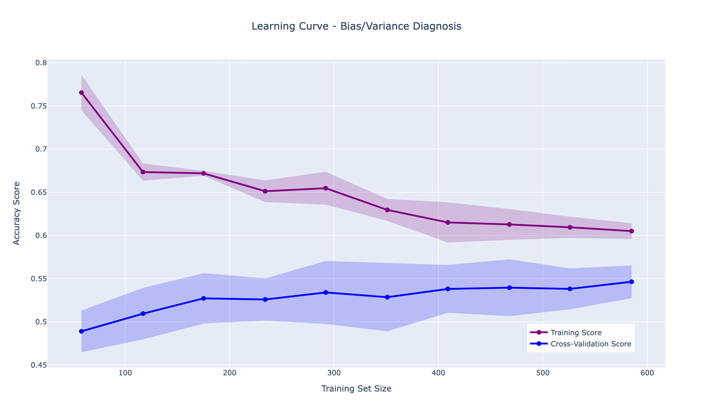

# Heart Disease Prediction

Predicting cardiovascular disease severity using clinical data: a complete data science pipeline from raw data to deployed web application.

---

## Table of Contents

1. [Overview](#1-overview)
2. [Exploratory Data Analysis](#2-exploratory-data-analysis)
3. [Imputation Experiments](#3-imputation-experiments)
4. [Feature Engineering](#4-feature-engineering)
5. [Model Comparison & Selection](#5-model-comparison--selection)
6. [Final Model & Implementation Pipeline](#6-final-model--implementation-pipeline)
7. [Web Application](#7-web-application)
8. [Dockerization & Deployment](#8-dockerization--deployment)

---

## 1. Overview

This project is a Master's degree assignment centered on a **Kaggle competition**, designed to architect a production-ready system that handles the complexities of clinical data while fulfilling specific evaluation requirements.

While the original academic requirement focused on model accuracy and submission, I extended the scope to implement a full-stack Data Science solution. This includes modularizing the code, containerizing the environment with Docker, and developing an interactive web interface for real-time risk assessment.

The implementation follows the following pipeline:

1. **EDA:** Analyzing feature distributions and identifying null values (`-9`, `?`).
2. **Imputation:** Comparing Median/Mode, KNN, and MICE (Iterative) strategies to impute missing values.
3. **Feature Engineering:** Creating domain-specific indicators.
4. **Model Implementation:** Implementing a training pipeline.
5. **Deployment:** Developing a **Streamlit** web application wrapped in a **Docker** container for platform-independent execution.

> A Note on Evaluation Metrics: Accuracy was the primary Kaggle leaderboard metric. However, due to the unbalanced classes inherent in heart disease severity stages, this project emphasizes that Accuracy can be misleading. In a clinical setting, F1-Score or Recall would be the priority to minimize false negatives.

---

### Project Structure

```
heart-disease-prediction/
│
├── data/
│   ├── raw/
│   │   ├── train.csv                     # Training dataset
│   │   └── test.csv                      # Test dataset
│   └── processed/
│       └── submission.csv                # Model predictions
│
├── models/
│   ├── heart_disease_model.pkl           # Trained model
│   ├── features_list.pkl                 # List of features
│   └── scaler.pkl                        # Model scaler
│
├── notebooks/
│   ├── 01_eda_and_imputation.ipynb       # Exploratory analysis
│   └── 02_model_experimentation.ipynb    # Model development
│
├── src/
│   ├── __init__.py                       # Package initialization
│   ├── data_loader.py                    # Imputation strategies
│   ├── features.py                       # Feature engineering
│   ├── models.py                         # Model implementations
│   └── plots.py                          # Visualization utilities
│
├── main.py                               # Training pipeline
├── app.py                                # Streamlit web design
├── requirements.txt                      # Python dependencies
├── Dockerfile                            # Container configuration
└── README.md                             # Project documentation
```

---

## 2. Exploratory Data Analysis

### 2.1 Dataset Overview

The dataset contains **732 training samples** and **184 test samples** with 13 clinical features predicting heart disease severity across 5 classes (0-4).

#### Clinical Features

| Feature | Type | Description | Values | Clinical Significance |
|---------|------|-------------|--------|----------------------|
| `age` | Numerical | Age in years | 20-90 | Primary cardiovascular risk factor |
| `sex` | Categorical | Gender | 0: Female, 1: Male | Male sex increases risk |
| `cp` | Categorical | Chest pain type | 1-4 | Symptom severity indicator |
| `trestbps` | Numerical | Resting blood pressure (mm Hg) | 90-200 | Hypertension screening |
| `chol` | Numerical | Serum cholesterol (mg/dl) | 100-600 | Atherosclerosis risk marker |
| `fbs` | Binary | Fasting blood sugar > 120 mg/dl | 0: No, 1: Yes | Diabetes indicator |
| `restecg` | Categorical | Resting ECG results | 0-2 | Electrical abnormalities |
| `thalach` | Numerical | Maximum heart rate achieved | 60-220 | Exercise capacity measure |
| `exang` | Binary | Exercise-induced angina | 0: No, 1: Yes | Ischemia under stress |
| `oldpeak` | Numerical | ST depression | 0.0-6.0 | Myocardial ischemia severity |
| `slope` | Categorical | ST segment slope | 1-3 | Recovery pattern analysis |
| `ca` | Categorical | Major vessels colored | 0-3 | Coronary artery blockage |
| `thal` | Categorical | Thalassemia | 3, 6, 7 | Blood disorder test |

#### Target Variable
- **`label`**: Heart disease severity
  - **0**: No disease (healthy)
  - **1**: Mild disease
  - **2**: Moderate disease
  - **3**: Severe disease
  - **4**: Very severe disease

### 2.2 Missing Values Analysis

The dataset contained two distinct encoding types representing missing information: numeric values **`-9`** and text characters **`?`**. Separate analysis of both patterns reveals structural problems in certain key variables.


#### Missing Pattern: `-9` Encoding

This encoding severely affects three variables that exceed the critical **20% threshold** for missing data:

- **`ca` (Major Vessels)**: **47.6%** missing
  - Most compromised variable
  - Critical diagnostic test for coronary artery disease
  - High missing rate suggests systematic data collection issues

- **`thal` (Thalassemia)**: **37.3%** missing
  - Blood disorder test indicating genetic conditions
  - Missing data may reflect cost or availability constraints

- **`slope` (ST Segment Slope)**: **23.9%** missing
  - Pattern of ST segment during peak exercise
  - Less critical than ca/thal, but still significant

- **Minor Affected Variables**: `chol` and `fbs` show minimal impact 

#### Missing Pattern: `?` Encoding

This encoding is more widespread (affects 9 features) but with lower intensity in most:

- **`ca`**: **34.0%** missing (again, most problematic)
- **`thal`**: **23.1%** missing (second most problematic)
- Both exceed the 20% cutoff line

- **Moderate Impact Variables**:
  - `slope`: 13.0%
  - `fbs`, `oldpeak`: 6-13% range
  - More manageable but still requiring attention

There is **systematic information loss** in variables `ca` (number of major vessels) and `thal` (thalassemia). When combining both error sources, these columns have **more than 50%** of their data compromised.

---

## 3. Imputation Experiments

We conducted a rigorous comparison of imputation strategies to handle the two distinct missing value patterns (`-9` and `?`). Each strategy was evaluated using 5-fold Stratified Cross-Validation and a Logistic Regression on the training set.

### Imputation Strategies for `-9` Values

#### Strategy 1: Simple Imputation (Median/Mode)
**Method**: 
- Numerical features → Replace with **median** (calculated from training set only)
- Categorical features → Replace with **mode**

**Why It Won**: 
- Best generalization to unseen data
- Robust to noise
- No artificial relationships created

---

#### Strategy 2: Healthy Values Imputation
**Method**: 
Replace `-9` with typical values in healthy individuals:

**Logic**: 
- Observation: Rows with many `-9` values correlated with label=0 (no disease)
- Hypothesis: Tests not performed because patient appeared healthy

**Analysis**: 
- Domain-driven approach showed promise
- Outperformed categorization
- But introduced bias: assumes missing = healthy (not always true)

---

#### Strategy 3: KNN Imputation
**Method**: 
- Uses **5 nearest neighbors** to predict missing values
- Creates binary indicator columns (`feature_is_q`) to preserve `?` information
- Predicts `-9` values based on similar patient profiles

**Why It Failed**: 
- Created **artificial relationships** not present in new data
- Too complex for dataset size (732 samples)
- High variance, poor generalization

---

#### Strategy 4: MICE (Multivariate Imputation by Chained Equations)
**Method**: 
- Iterative process (max 100 iterations)
- Models each feature with missing values as function of others
- Most sophisticated statistical approach

**Why It Failed**: 
- Iterative process **forced relationships** that don't exist
- Small dataset (732 samples) insufficient for complexity
- Created spurious correlations specific to training data

---

#### Strategy 5: Categorization
**Method**: 
- Treat `-9` as new category
- Numerical: `-9` → `-1` (all original values were positive)
- Categorical: `-9` → `'Other'`

**Why It Failed**: 
- Logistic Regression assumes ordinal relationships
- Introducing arbitrary value (-1) **breaks linearity**
- Model interprets -1 as extreme negative value, not missing indicator

---

### Imputation Strategies for `?` Values

After handling `-9`, we applied second-stage imputation for `?` encoded values using the same strategies.

---

### Why Simple Imputation Won

Despite **KNN** and **MICE** showing slightly superior metrics in internal cross-validation, simple **median/mode imputation** demonstrated superior generalization capability on the external test set (Kaggle). 

**Explanation**: Complex methods incurred **overfitting**, generating artificial relationships that didn't hold with new data.

**Why Simple is Better**:
1. **Robust to Noise**: Static values don't create spurious patterns
2. **No Assumptions**: Doesn't assume specific missing mechanisms
3. **Prevents Leakage**: Test set statistics never used
4. **Stable**: Low variance across folds

---

## 4. Feature Engineering

We created **7 new features** based on cardiovascular medicine literature and domain expertise. These features capture non-linear relationships and clinical risk patterns that raw features alone cannot express.

### 4.1 Engineered Features

#### 1. `combined_risk` (Weight: **-0.4175**) 
**Formula**: 
```python
combined_risk = (
    (age > 55) + 
    (sex == 1) +      
    (chol > 240) + 
    (trestbps > 140) + 
    exang
)
```

**Description**: Sums +1 for each risk factor present: Age > 55, male sex, cholesterol > 240, blood pressure > 140, and exercise-induced angina.

**Impact**: **Most important variable in the model**. By grouping multiple weak signals into a single strong score, it enabled the algorithm to identify high-risk profiles with high precision.

---

#### 2. `chest_pain_severity` (Weight: **+0.2322**)
**Formula**: 
```python
chest_pain_severity = 4 - cp
```

**Description**: Linear transformation of chest pain type to give it ordinal severity sense.

**Original Encoding**:
- 1: Typical Angina (most severe)
- 2: Atypical Angina
- 3: Non-Anginal Pain
- 4: Asymptomatic (least severe)

**Transformation**: Inverts scale so higher values = more severe

---

#### 3. `age_chol_interaction` (Weight: **+0.1870**)
**Formula**: 
```python
age_chol_interaction = (age * chol) / 1000
```

**Description**: Interaction between age and cholesterol.

**Impact**: Had much more weight than age alone, demonstrating that **context matters more than isolated data**.

---

#### 4. `hr_achievement` (Weight: **+0.1045**)
**Formula**: 
```python
hr_achievement = thalach / (220 - age)
```

**Description**: Percentage of theoretical maximum heart rate achieved during stress test.

---

#### 5. `bp_risk` (Weight: **+0.0686**)
**Formula**: 
```python
bp_risk = abs(trestbps - 120)
```

**Description**: Absolute deviation of blood pressure from ideal baseline.

**Impact**: Helps identify severe hypotension as risk factor, which linear `trestbps` doesn't capture well.

---

#### 6. `oldpeak_age_adjusted` (Weight: **-0.1695**)
**Formula**: 
```python
oldpeak_age_adjusted = oldpeak * (age / 50)
```

**Description**: ST depression adjusted by age.

---

#### 7. `chol_risk` (Weight: **~0.0000**)
**Formula**: 
```python
chol_risk = 1 if chol > 200 else 0
```

**Description**: Binary flag for high cholesterol.

**Impact**: **Nearly zero weight** - model discarded this variable.

**Why It Failed**: 
- Simplifying continuous data to binary Yes/No loses valuable information
- Model preferred `chol` and `age_chol_interaction` which preserve nuance

---

### 4.2 Feature Importance Analysis


#### Top 10 Most Important Features

1. **`combined_risk`** (-0.4175): Strongest predictor
2. **`cp_4.0`** (-0.2500): Asymptomatic chest pain
3. **`cp_2.0`** (+0.2600): Atypical angina
4. **`chest_pain_severity`** (+0.2322): Severity gradient
5. **`chol`** (+0.2280): Cholesterol level
6. **`age_chol_interaction`** (+0.1870): Age-cholesterol synergy
7. **`oldpeak_age_adjusted`** (-0.1695): Age-adjusted ST depression
8. **`thalach`** (-0.1432): Maximum heart rate
9. **`hr_achievement`** (+0.1045): Heart rate achievement %
10. **`bp_risk`** (+0.0686): Blood pressure deviation

---

### 4.3 Counterintuitive Findings

Several feature weights don't align with medical intuition. Analysis reveals real-world data complexities:

#### Finding 1: High Cholesterol → No Disease (Positive Weight)
**Expected**: High cholesterol → disease (negative weight)  
**Observed**: High cholesterol → NO disease (positive weight)

**Explanation - Medication Bias**:
```
Sick patients → prescribed statins → low cholesterol
Healthy patients → no medication → naturally high cholesterol
Model learns: high chol = not on meds = healthy
```

**Key Insight**: Real-world data includes treatment effects, not just disease biology.

---

#### Finding 2: Asymptomatic → Disease
**Expected**: More severe pain → more disease  
**Observed**: Asymptomatic patients → MORE disease

**Explanation - Silent Ischemia**:
```
Classic presentation:
Patient with chest pain → gets tested → early detection → less severe disease

Silent ischemia (asymptomatic):
No warning symptoms → no early detection → advanced disease when discovered
```

**Clinical Reality**: ~25% of heart attacks are "silent" (no chest pain). Diabetic neuropathy can mask cardiac symptoms. **This actually makes medical sense!**

---

### 4.4 Summary Table

<div align="center">

| Status | Variable | Description |
|:---|:---|:---|
| **Original** | `age` | Patient age |
| **Original** | `sex` | Sex (0: female, 1: male) |
| **Original** | `trestbps` | Resting blood pressure |
| **Original** | `chol` | Serum cholesterol |
| **Original** | `fbs` | Fasting blood sugar >120 mg/dl |
| **Original** | `restecg` | Resting ECG results |
| **Original** | `thalach` | Maximum heart rate achieved |
| **Original** | `exang` | Exercise-induced angina |
| **Original** | `oldpeak` | ST depression |
| **Original** | `slope` | ST segment slope (ordinal) |
| **Original** | `cp` | Chest pain type (1, 2, 3, 4) |
| **Eliminated** | `ca` | >50% missing values |
| **Eliminated** | `thal` | >50% missing values |
| **New** | `combined_risk` | Sum of 5 major risk factors |
| **New** | `chest_pain_severity` | Ordinal pain conversion |
| **New** | `age_chol_interaction` | Age × cholesterol synergy |
| **New** | `hr_achievement` | % theoretical max HR |
| **New** | `bp_risk` | Distance from ideal BP (120) |
| **New** | `oldpeak_age_adj` | Age-adjusted ST depression |
| **New** | `chol_risk` | Binary cholesterol flag |
| **OHE** | `cp_{1.0-4.0}` | One-hot encoded chest pain |
| **OHE** | `restecg_{0.0-2.0}` | One-hot encoded ECG results |

</div>

---

## 5. Model Comparison & Selection

### 5.1 Encoding Strategy

Logistic Regression requires numerical inputs. Our encoding strategy depended on the nature of each categorical variable:

#### Label Encoding
**Applied to**: Binary and ordinal variables (`sex`, `fbs`, `exang`, `slope`)

**Logic**:
- Maintains low dimensionality
- Preserves inherent order where "greater" means different medical significance

#### One-Hot Encoding
**Applied to**: Nominal variables (`cp`, `restecg`, `ca`, `thal`)

**Logic**:
- Chest pain type 1 is not "less than" type 4; they're qualitatively different
- Avoids false mathematical ordering
- Creates binary dummy variables

---

### 5.2 Standardization

**Method**: `StandardScaler` applied to all input features before training.

**Formula**:
$$
z = \frac{x - \mu}{\sigma}
$$

**Why Critical**:
1. **Gradient Optimization**: Logistic Regression uses gradient descent. Without standardization, variables with large magnitudes dominate.
2. **Fair Comparison**: Puts all features on equal footing (mean=0, std=1)
3. **Regularization**: L2 penalty only works fairly when features are same scale

---

### 5.3 Model Comparison Results

We compared Logistic Regression against several algorithms using **5-fold Stratified Cross-Validation**:

<div align="center">

| Model | Best CV Score |
|:---|:---:|
| **Logistic Regression (C=0.1)** | **0.541003** | 
| Gradient Boosting | 0.538188 | 
| Random Forest | 0.538188 | 
| SVM (RBF) | 0.532774 | 
| SVM (Linear) | 0.532774 | 

</div>

### 5.4 Why Logistic Regression Won

#### Reason 1: Dataset Size (732 samples)
```
Complex models need more data:
Random Forest: ~1000+ samples per tree
Gradient Boosting: ~5000+ for stable performance

Our data: 732 samples → Simple models better suited
```

#### Reason 2: High Dimensionality (40+ features)
After one-hot encoding: ~40 total dimensions

**Curse of dimensionality**:
```
High dimensions + small sample size
    ↓
Complex models overfit easily
    ↓
Simple linear model more robust
```

#### Reason 3: Kaggle Competition Context
**Goal**: Maximize accuracy on unseen test set

**Best Strategy**: Avoid overfitting at all costs → Simpler models generalize better

---

### 5.5 Understanding Regularization: Why C=0.1 Works Best

#### The Mathematical Foundation

Logistic regression with L2 regularization minimizes:

$$
J(\theta) = -\frac{1}{m} \sum_{i=1}^{m} \left[y^{(i)} \log(h_\theta(x^{(i)})) + (1-y^{(i)})\log(1-h_\theta(x^{(i)}))\right] + \lambda \sum_{j=1}^{n}\theta_j^2
$$

Where:
- $h_\theta(x) = \frac{1}{1 + e^{-\theta^T x}}$ is the sigmoid function
- $\lambda$ is the regularization strength
- $C = \frac{1}{\lambda}$ (inverse relationship)

#### The Bias-Variance Tradeoff

**High C (Weak Regularization)**:
```
C = 100 (λ = 0.01)
    ↓
High Variance → Overfits training data
    ↓
Poor test performance
```

**Low C (Strong Regularization)**:
```
C = 0.1 (λ = 10)
    ↓
High Bias → Slightly underfits
    ↓
Best generalization
```

#### Why C=0.1 Excels

**1. Small Dataset (732 samples)**
```
Limited data → Complex models overfit easily
    ↓
Strong regularization prevents memorizing noise
    ↓
Forces model to learn only robust patterns
```

**2. High Dimensionality (40+ features)**
$$
\text{Overfitting Risk} \propto \frac{\text{Features}}{\text{Samples}} = \frac{40}{732} \approx 0.055
$$

**Solution**: Strong regularization crucial for feature selection

**3. Imputed Values** introduce uncertainty → Regularization provides robustness

**4. Kaggle Context**: Simpler models generalize better → C=0.1 achieves best test performance

---

### 5.6 Bias-Variance Analysis



#### Key Observations

**1. High Bias (Underfitting) - Primary Issue**
- Training curve plateaus around **0.59 accuracy**
- Model struggles to learn patterns even on seen data

**Conclusion**: We're hitting **irreducible error** or data limitation. 

**2. Low Variance (Good Generalization)**
- Gap between training and validation closes
- Almost identical performance on both sets
- Model not memorizing

**3. Flat Curves - Data Quality Issue**
- Adding more samples probably won't help
- Problem is **quality** of features, not **quantity** of patients

---

### 5.7 Cascaded Models: Real-World vs Competition Context

While simple Logistic Regression achieved the best Kaggle performance, we also explored **hierarchical cascaded models** that offer advantages for real-world clinical deployment.

#### Cascaded Logistic Regression

**Architecture**:
```
Stage 1: Binary Classification
├─ Healthy (0) vs Diseased (1,2,3,4)
│
└─ Stage 2: Multi-class Classification (if diseased)
   ├─ Severity 1 (Mild)
   ├─ Severity 2 (Moderate)
   ├─ Severity 3 (Severe)
   └─ Severity 4 (Very Severe)
```

#### Thresholded Cascaded Model

An extension that uses confidence thresholds to prioritize the "Healthy" classification.

#### Why Cascaded Models Matter for Real-World Deployment

**Advantages**:

1. **Clinical Interpretability**
   - Mirrors actual diagnostic workflow: "Is there disease?" → "How severe?"
   - Easier for doctors to understand hierarchical decision-making

2. **Cost-Sensitive Decisions**
   - Threshold tuning allows balancing false positives vs false negatives
   - In screening: Prefer false positives (better safe than sorry)
   - In confirmation: Prefer specificity (avoid unnecessary treatment)

3. **Modular Updates**
   - Can retrain binary model without touching severity classifier
   - Easier to incorporate new "healthy" biomarkers separately

4. **Explainability**
   - "Patient classified as diseased because binary model detected X, Y, Z risk factors"
   - Then "Severity 3 because multiclass model observed high oldpeak and low thalach"

**Why They Lost in Kaggle**:
```
Kaggle Metric: Overall Accuracy
    ↓
Cascaded approach introduces two points of error:
- Error in Stage 1 (healthy vs diseased)
- Error in Stage 2 (severity classification)
    ↓
Errors compound: wrong at Stage 1 = guaranteed wrong final prediction
    ↓
Simple unified model has single error source
    ↓
Better overall accuracy
```

For the **Kaggle competition**, simple Logistic Regression with strong regularization (C=0.1) was optimal due to the accuracy metric and dataset size.

For **real-world clinical deployment**, cascaded models offer:
- Better interpretability for medical professionals
- Flexibility in threshold tuning for different use cases (screening vs diagnosis)
- Modular architecture for easier maintenance and updates

The choice between approaches depends on the deployment context: competition leaderboards favor unified models, while clinical practice benefits from hierarchical, interpretable systems.

---

## 6. Final Model & Implementation Pipeline

### 6.1 Training Pipeline (`main.py`)

The complete training pipeline is orchestrated in `main.py`:

```python
python main.py
```

**Pipeline Steps**:
1. Load raw training and test data
2. Apply imputation strategies (median/mode for both `-9` and `?`)
3. Engineer 7 new features
4. Encode categorical variables (Label + One-Hot)
5. Standardize features with `StandardScaler`
6. Train Logistic Regression with Grid Search (C=0.1)
7. Evaluate with 5-fold Stratified Cross-Validation
8. Serialize model, scaler, and feature list
9. Generate submission file

**Output Files**:
- `models/heart_disease_model.pkl` - Trained model
- `models/scaler.pkl` - Fitted StandardScaler
- `models/features_list.pkl` - Expected feature names
- `data/processed/submission.csv` - Kaggle predictions

---

## 7. Web Application

### 7.1 Streamlit Interface

An interactive web application for real-time heart disease risk assessment.

---

### 7.2 App Features

#### Patient Data Entry
Sidebar collects comprehensive patient information:
- **Demographics**: Age, sex
- **Symptoms**: Chest pain type, exercise-induced angina
- **Vital Signs**: Blood pressure, cholesterol, fasting blood sugar
- **Cardiac Tests**: ECG results, heart rate, ST depression
- **Advanced Tests**: Fluoroscopy results, thalassemia

#### Risk Assessment
Click "**Analyze Risk**" to get:
- **Risk Classification**: Low Risk (green) or Elevated Risk (red)
- **Confidence Score**: Percentage confidence
- **Severity Level**: For positive cases (1-4 scale)
- **Probability Distribution**: Bar chart across all classes
- **Top Risk Factors**: Features contributing most to prediction

---

## 8. Dockerization & Deployment

### 8.1 Docker Configuration

#### Build Image
```bash
docker build -t heart-disease-app .
```

#### Run Container
```bash
docker run -p 8501:8501 \
  -v "$(pwd)/models:/app/models" \
  -v "$(pwd)/data:/app/data" \
  heart-disease-app
```

#### Access
Navigate to: `http://localhost:8501`

---

## Key Learnings

### 1. Simple Often Beats Complex
- Median/mode imputation outperformed KNN and MICE
- Logistic Regression beat ensemble methods
- **Lesson**: Match model complexity to dataset size

### 2. Feature Engineering Matters
- `combined_risk` was single most important feature
- 3-4 engineered features showed significant improvement
- Domain knowledge > blind feature selection

### 3. Regularization is Crucial
- C=0.1 (strong L2 penalty) prevented overfitting
- Small dataset + high dimensionality = need constraints
- Simpler models generalize better for Kaggle

### 4. Real-World Data Complexity
- Medication bias affects cholesterol interpretation
- Silent ischemia explains asymptomatic → disease
- Missing patterns reveal data collection issues

---

## Author

**Marta Soler Ebri** - Master's Degree Project - [GitHub](https://github.com/martasolerebri)

---

*Last Updated: December 2024*